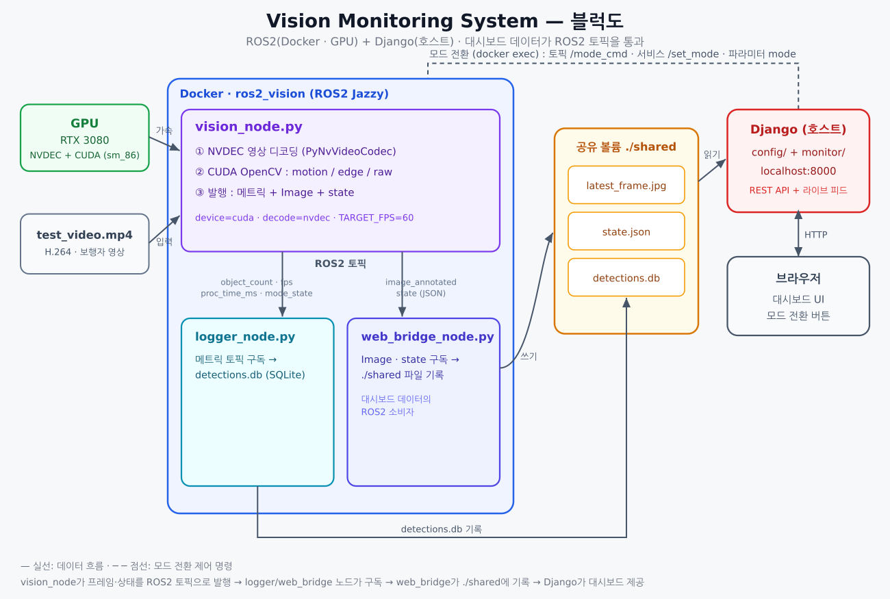

# Vision Monitoring System (비전 모니터링 시스템)

**ROS2(Jazzy) 컨테이너**가 컴퓨터 비전 처리를 담당하고,
**WSL2 호스트의 Django 웹 대시보드**가 결과를 실시간으로 보여주며 브라우저에서 처리 모드를 전환한다.
GPU(NVIDIA RTX 3080)로 **영상 디코딩(NVDEC)** 과 **비전 연산(CUDA OpenCV)** 을 모두 가속하고,
**대시보드가 보는 데이터는 ROS2 토픽을 통과**해서 흐른다.

---

## 0. 프로젝트 목적 (왜 만들었나)

이 프로젝트는 **실시간 영상 분석 파이프라인을 ROS2 기반으로 설계하고, GPU 가속과 웹 모니터링까지 하나로 통합**하는 것을 목표로 만들었다. 단순히 OpenCV로 영상을 처리하는 데서 그치지 않고, 실제 임베디드/로보틱스 시스템에서 쓰이는 구조(노드 분리, 토픽·서비스·파라미터 통신, 컨테이너 배포)를 직접 구현하고 검증하는 데 초점을 뒀다.

동기와 학습 목표:

- **ROS2 아키텍처 체득** — 처리(`vision_node`)·기록(`logger_node`)·웹 연동(`web_bridge_node`)의 책임을 노드로 분리하고, 토픽 / 커스텀 서비스(`SetMode`) / 파라미터로 통신하는 모듈식 구조를 설계한다.
- **GPU 가속의 실효성 확인** — 영상 디코딩(NVDEC)과 비전 연산(CUDA OpenCV)을 GPU로 옮겨, CPU 대비 처리량이 어떻게 달라지는지(약 15fps → 60fps급) 직접 측정한다.
- **시각화의 현대화** — 무거운 rviz / 데스크톱 GUI 대신 어디서든 접속 가능한 **웹 대시보드**로 상태를 보고 모드를 전환한다. 처리(백엔드)와 표시(프론트엔드)를 분리하는 실전 패턴.
- **컨테이너 기반 재현성** — Docker로 ROS2 + CUDA 환경을 고정해, 복잡한 의존성(ROS2 / CUDA / OpenCV) 설치 없이도 동일하게 실행되도록 한다.

요약하면, "**GPU로 가속된 비전 처리 + ROS2 노드 통신 + 웹 모니터링**"이라는 감시·모니터링 시스템의 축소판을 직접 구축해 보는 프로젝트다.

---

## 1. 전체 구조

블럭도: [`docs/architecture.svg`](docs/architecture.svg) (PNG: [`docs/architecture.png`](docs/architecture.png))



```
┌──────────────── Docker 컨테이너: ros2_vision (ROS2 Jazzy) ─────────────────┐
│                                                                           │
│  vision_node.py                                                           │
│   - NVDEC 디코딩(GPU) + CUDA OpenCV (motion / edge / raw)                  │
│   - 발행: object_count·fps·proc_time_ms·mode_state, image_annotated, state │
│   - 구독: /vision/mode_cmd                                                 │
│        │  (ROS2 토픽)                                                      │
│        ├──► logger_node.py      →  ./shared/detections.db (SQLite)         │
│        └──► web_bridge_node.py  →  ./shared/latest_frame.jpg + state.json  │
└───────────────────────────────────┬───────────────────────────────────────┘
                                     │  ./shared (bind mount)
┌─────────────────────────────────── ▼ ──────────── WSL2 호스트 ─────────────┐
│  Django (config/ + monitor/)  ─ ./shared 읽기 ─►  http://localhost:8000     │
│  모드 버튼 ─► docker exec ros2_vision ros2 topic pub /vision/mode_cmd ─►     │
└────────────────────────────────────────────────────────────────────────────┘
```

- **컨테이너(ROS2)**: 영상 디코딩 + 비전 처리 → 결과를 **ROS2 토픽으로 발행**
- `logger_node` / `web_bridge_node` 가 그 토픽을 **구독**해서 SQLite / 공유 파일로 기록
- **호스트(Django)**: `./shared/` 를 읽어 웹 대시보드 제공, 모드 전환 명령 전달
- 즉 데이터 경로: `vision_node → (ROS2 토픽) → web_bridge_node → ./shared → Django`

---

## 2. 구성 요소

| 경로 | 실행 위치 | 역할 |
|------|----------|------|
| `Dockerfile`, `docker-compose.yml` | — | **CPU 버전** 컨테이너 빌드/실행 |
| `Dockerfile.cuda`, `docker-compose.cuda.yml` | — | **GPU 버전** 컨테이너 빌드/실행 |
| `ros2_nodes/vision_node.py` | 컨테이너 | 영상 디코딩·비전 처리 → 메트릭 + 주석 프레임(Image) + 상태(JSON) **발행** |
| `ros2_nodes/logger_node.py` | 컨테이너 | 메트릭 토픽 **구독** → `shared/detections.db` 기록 |
| `ros2_nodes/web_bridge_node.py` | 컨테이너 | `image_annotated`·`state` 토픽 **구독** → `shared/`에 프레임/상태 파일 기록 (대시보드 데이터의 ROS2 소비자) |
| `ros2_nodes/run_nodes.py` | 컨테이너 | 세 노드를 하나의 MultiThreadedExecutor로 실행(엔트리포인트) |
| `ros2_ws/src/vision_interfaces/` | 컨테이너(빌드) | 커스텀 서비스 인터페이스 `srv/SetMode` (colcon 빌드) |
| `config/`, `monitor/`, `manage.py` | 호스트(venv) | Django 대시보드 |
| `shared/` | 공유 볼륨 | `latest_frame.jpg`, `state.json`, `detections.db` |
| `test_video.mp4` | 읽기 전용 마운트 | 데모 입력 (OpenCV 표준 보행자 영상, H.264) |
| `test_video_bars.mp4` | 백업 | 초기 합성 컬러바 영상(되돌릴 때 사용) |

### 처리 모드
- **motion** — MOG2 배경차분으로 움직이는 객체에 초록 박스. `object_count` = 검출 객체 수
- **edge** — Canny 엣지 검출. 화면이 엣지 영상으로. `object_count` = 엣지 윤곽 수
- **raw** — 원본 패스스루. `object_count` = 0

### ROS2 토픽
| 토픽 | 타입 | 방향 |
|------|------|------|
| `/vision/object_count` | `std_msgs/Int32` | vision → logger |
| `/vision/fps` | `std_msgs/Float32` | vision → logger |
| `/vision/proc_time_ms` | `std_msgs/Float32` | vision → logger |
| `/vision/mode_state` | `std_msgs/String` | vision → logger |
| `/vision/image_annotated` | `sensor_msgs/Image` | vision → web_bridge |
| `/vision/state` | `std_msgs/String` (JSON) | vision → web_bridge |
| `/vision/mode_cmd` | `std_msgs/String` | 대시보드/CLI → vision |

### ROS2 서비스 / 파라미터 (모드 전환)
| 종류 | 이름 | 타입 |
|------|------|------|
| 서비스 | `/vision/set_mode` | `vision_interfaces/srv/SetMode` (string mode → bool success, string message) |
| 파라미터 | `mode` (노드 `/vision_node`) | string (`motion`/`edge`/`raw`) |

### 대시보드 엔드포인트
| 엔드포인트 | 반환 |
|-----------|------|
| `GET /` | 대시보드 HTML |
| `GET /api/state` | 최신 `state.json` (+ `online` 플래그) |
| `GET /api/logs?limit=N` | 최근 검출 로그(DB, 최신순) |
| `GET /api/history?limit=N` | object_count / fps 시계열 |
| `GET /video_feed` | 최신 주석 프레임 JPEG |
| `POST /set_mode` (`mode=motion\|edge\|raw`) | `/vision/mode_cmd` 발행 (docker exec) |

`state.json` 예시:
```json
{"mode":"motion","device":"cuda","decode":"nvdec","object_count":6,
 "fps":58.9,"proc_time_ms":3.4,"timestamp":1781734258.5}
```

---

## 3. ROS2 가 하는 일 (관여 범위)

이 프로젝트에서 ROS2는 다음을 담당한다.

1. **노드 구조** — `vision_node` / `logger_node` / `web_bridge_node` (`rclpy.Node`),
   `MultiThreadedExecutor` 로 한 프로세스에서 실행. 처리 루프는 rclpy 타이머.
2. **노드 간 통신(데이터 경로의 핵심)** — `vision_node` 가 메트릭 + 주석 프레임(`sensor_msgs/Image`)
   + 상태(JSON)를 **토픽으로 발행**하고, `logger_node` 와 `web_bridge_node` 가 **구독**한다.
   대시보드가 읽는 `latest_frame.jpg`/`state.json` 은 `web_bridge_node`(ROS2 구독자)가 생성하므로,
   **대시보드 데이터가 실제로 ROS2 토픽을 통과**한다.
3. **모드 전환 — 3가지 ROS2 방식 (모두 `_apply_mode` 로 수렴)**:
   - **토픽** `/vision/mode_cmd` (`std_msgs/String`)
   - **서비스** `/vision/set_mode` (**커스텀 인터페이스** `vision_interfaces/srv/SetMode`, `ros2_ws/` 에서 colcon 빌드)
   - **파라미터** `mode` (`ros2 param set`, 잘못된 값은 `SetParametersResult` 로 거부)

   대시보드(Django)는 **서비스**를 호출하고(실패 시 토픽으로 폴백), CLI로는 셋 다 시연 가능.
4. **콜백 그룹 / QoS** — `mode_cmd`·`set_mode` 는 전용 콜백 그룹, `image_annotated` 는 sensor-data QoS(BEST_EFFORT).

데모로 보여줄 수 있는 ROS2 확인:
```bash
ros2 node list                          # /vision_node /logger_node /web_bridge_node
ros2 topic list                         # /vision/* 토픽들
ros2 service list | grep set_mode       # /vision/set_mode
ros2 interface show vision_interfaces/srv/SetMode
ros2 topic hz /vision/image_annotated   # 프레임이 토픽으로 전송됨
ros2 topic echo /vision/object_count    # 실시간 메트릭

# 모드 전환 3가지
ros2 topic pub --once /vision/mode_cmd std_msgs/msg/String '{data: edge}'
ros2 service call /vision/set_mode vision_interfaces/srv/SetMode '{mode: raw}'
ros2 param set /vision_node mode motion
```

---

## 4. GPU 버전 구성

| 항목 | 내용 |
|------|------|
| 파일 | `Dockerfile.cuda`, `docker-compose.cuda.yml` |
| 베이스 이미지 | `ros:jazzy-ros-base` + CUDA Toolkit 12.6 |
| OpenCV | 소스 빌드 4.10 + CUDA (sm_86) |
| 영상 디코딩 | GPU NVDEC (PyNvVideoCodec) |
| 비전 연산 | GPU (cv2.cuda MOG2 / Canny / cvtColor) |

`vision_node.py` 는 **자동 감지 + 폴백**: CUDA 장치가 보이면 GPU, 없으면 CPU. NVDEC 실패 시 CPU 디코딩으로 폴백.
현재 장치는 `state.json` 의 `device`/`decode`, 프레임 오버레이 `[CUDA|dec:nvdec]`, 대시보드 배지로 표시.

---

## 5. 실행 방법

### 사전 요구사항
- Docker + Docker Compose, WSL2
- (GPU 버전) NVIDIA GPU + 드라이버, `nvidia-container-toolkit`, docker `nvidia` 런타임
- (GPU 디코딩) WSL 드라이버 라이브러리 `libnvcuvid.so.1`, `libnvidia-encode.so.1`
  (호스트 `/usr/lib/wsl/lib/` 에 존재 → compose 가 컨테이너로 bind-mount)

### GPU 버전 (권장)
```bash
cd ~/vision_monitor

# 1) GPU 컨테이너 (최초 1회만 빌드: CUDA OpenCV 컴파일 ~30분)
docker compose -f docker-compose.cuda.yml up -d --build
#   이후엔 빌드 캐시되어 빠름:  docker compose -f docker-compose.cuda.yml up -d

# 2) Django 대시보드
python3 -m venv .venv                 # 최초 1회
source .venv/bin/activate
pip install -r requirements.txt       # 최초 1회 (필요시 --break-system-packages)
python3 manage.py migrate             # 최초 1회
python3 manage.py runserver 0.0.0.0:8000
```

### CPU 버전
```bash
cd ~/vision_monitor
docker compose up -d --build          # 기본 docker-compose.yml
source .venv/bin/activate && python3 manage.py runserver 0.0.0.0:8000
```
> 두 버전은 같은 컨테이너 이름(`ros2_vision`)을 써서 **동시에는 하나만** 실행된다.

### 종료
```bash
# Django: Ctrl-C
docker compose -f docker-compose.cuda.yml down     # GPU 버전
docker compose down                                # CPU 버전
```

브라우저: **http://localhost:8000**

---

## 6. 환경변수 (docker-compose.cuda.yml)

| 변수 | 기본값 | 설명 |
|------|--------|------|
| `DECODE_BACKEND` | `gpu` | `gpu`/`nvdec`=NVDEC GPU 디코딩, `cpu`=OpenCV CPU 디코딩 |
| `TARGET_FPS` | `60` | 처리 fps 상한. `120`, `auto`(영상 fps), `0`/`max`(무제한) |
| `WRITE_FPS` | `15` | 토픽 발행(프레임/상태) + 디스크 기록 속도 (처리 루프와 분리) |
| `VIDEO_PATH` | `/test_video.mp4` | 입력 영상 경로 |
| `SHARED_DIR` | `/shared` | 공유 폴더 |

성능 참고: GPU 디코딩 + GPU 처리 시 파이프라인 **천장 약 130fps**. 순수 처리시간은 프레임당 ~4.5ms이고,
실제 fps 상한은 ROS2 발행/스케줄링 오버헤드가 결정한다. Image 발행 때문에 실측 ~50fps 수준(60fps cap 이내).

---

## 7. 동작 검증

```bash
# 노드/디코딩 백엔드
docker logs ros2_vision | grep -E "started|Decode backend|FPS cap|CUDA enabled"

# ROS2 그래프
docker exec ros2_vision bash -lc "source /opt/ros/jazzy/setup.bash && ros2 node list"
docker exec ros2_vision bash -lc "source /opt/ros/jazzy/setup.bash && ros2 topic list"
docker exec ros2_vision bash -lc "source /opt/ros/jazzy/setup.bash && ros2 topic hz /vision/image_annotated"

# 공유 파일 / 대시보드 API
cat shared/state.json                                   # device:"cuda", decode:"nvdec"
curl -s localhost:8000/api/state
curl -s -X POST -d mode=edge localhost:8000/set_mode    # {"ok":true,"mode":"edge"}
```

---

## 8. 대시보드 표시

- 라이브 영상 표시 폭 **768px**(원본 해상도와 1:1 → 가장 선명, `monitor/templates/monitor/index.html` 의 `#feed max-width`)
- **metrics ↔ 영상 싱크**: 단일 루프(`SYNC_MS=100ms`)에서 `state.json` → 지표 갱신 후 같은 시점 프레임 새로고침
- 상단 배지 `GPU·CUDA · decode:NVDEC`, 객체 수 / FPS / 처리시간 / 모드, 히스토리 차트, 검출 로그 테이블, 모드 버튼

---

## 9. 데모 입력 영상

- 기본 `test_video.mp4` = OpenCV 표준 보행자 영상(`vtest.avi`, 768×576)을 **NVDEC 호환 H.264로 변환**한 것.
- 다른 영상으로 교체 시 **GPU 디코딩(NVDEC)을 쓰려면 H.264 코덱**이어야 함:
  ```bash
  ffmpeg -y -i 원본.mp4 -c:v libx264 -profile:v high -pix_fmt yuv420p -an test_video.mp4
  docker compose -f docker-compose.cuda.yml up -d --force-recreate
  ```
- 합성 컬러바로 되돌리기: `cp test_video_bars.mp4 test_video.mp4` 후 위 force-recreate.

---

## 10. 개발 중 해결한 문제 (Troubleshooting Log)

1. **베이스 이미지 부재** — `osrf/ros:jazzy-ros-base` 없음(`manifest unknown`). → 공식 **`ros:jazzy-ros-base`**.
2. **OpenCV 설치(CPU)** — Ubuntu 24.04 *externally-managed* pip 제약. → apt `python3-opencv`.
3. **파일 권한** — 컨테이너 root가 만든 0600 파일을 호스트 Django가 못 읽음. → 기록 시 `chmod 0644`.
4. **CUDA OpenCV 빌드 실패** — `WITH_CUDA=ON` 필수 `cudev` 모듈 누락. → `BUILD_LIST` 에 `cudev` 추가.
5. **모드 전환 미동작** — 무제한 fps에서 기본(상호배타) 콜백 그룹이 `mode_cmd` 구독을 굶김.
   → **별도 콜백 그룹** 분리 + Django 발행에 `--once -w 1`.
6. **GPU 디코딩** — OpenCV `cudacodec` 은 비공개 Video Codec SDK 헤더 필요(nv-codec-headers엔 없음).
   → **NVIDIA `PyNvVideoCodec`(pip)** 로 NVDEC 사용(OpenCV 재빌드 불필요).
7. **WSL2 NVDEC 라이브러리 미주입** — nvidia 런타임이 WSL2에선 `libnvcuvid`/`libnvidia-encode` 미주입.
   → 호스트 `/usr/lib/wsl/lib/` 에서 **bind-mount** + `ldconfig`.
8. **FPS ~50 병목** — 매 프레임 토픽 발행 → logger 과부하. → 텔레메트리/기록을 `WRITE_FPS` 로 분리,
   fps 측정을 **1초 슬라이딩 윈도우** 실측으로 정확화.
9. **대시보드 영상 크기/싱크** — 표시 폭 상한(768px) + metrics·프레임 단일 루프 동기화.
10. **ROS2 데이터 경로화** — 대시보드가 파일을 직접 읽어 ROS2를 우회하던 구조를,
    `image_annotated`/`state` **토픽 발행 + `web_bridge_node` 구독**으로 바꿔 **데이터가 ROS2를 통과**하도록 함.
11. **모드 전환을 ROS2 서비스 + 파라미터로 확장** — 커스텀 인터페이스 `vision_interfaces/srv/SetMode` 를
    colcon 빌드하여 `/vision/set_mode` 서비스 제공, `mode` 파라미터도 추가. Django는 서비스 호출(폴백: 토픽).
    (빌드 시 Dockerfile `RUN` 이 기본 `sh` 라 `source` 가 실패 → `bash -lc` 로 감싸고 CMD에서 오버레이 `source` 추가.)

---

## 11. 환경 정보 (개발/검증 환경)

- 호스트: WSL2 (Ubuntu 24.04), NVIDIA **RTX 3080** (sm_86, 12GB)
- 드라이버: nvidia-container-toolkit 1.19, docker `nvidia` 런타임
- 컨테이너: ROS2 Jazzy, CUDA Toolkit 12.6, OpenCV 4.10(CUDA), PyNvVideoCodec
- 호스트 Django: Python 3.12 venv, Django 5.2
